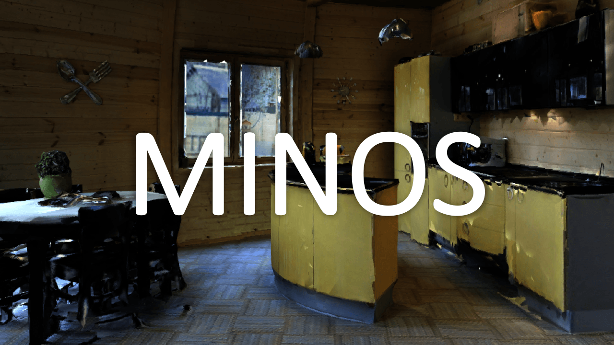

# MINOS Simulator

MINOS is a simulator designed to support the development of multisensory models for goal-directed navigation in complex indoor environments. MINOS leverages large datasets of complex 3D environments and supports flexible configuration of multimodal sensor suites.

[](https://youtu.be/c0mL9K64q84)

## Live demos

Try our live web client demos!

#### [MINOS for SUNCG](http://bitly.com/minos-demo-suncg)

#### [MINOS for Matterport3D](http://bitly.com/minos-demo-mp3d)

Use the I/J/K/L keys to step and turn, the arrow keys to strafe and look up or down, the R key to respawn, and the O key to update the agent observations panel on the right.

## Installing

1. Request and download the [SUNCG](https://http://suncg.cs.princeton.edu/) and [Matterport3D](https://niessner.github.io/Matterport/) datasets. Please indicate "use with MINOS simulator" in your request email.  If you are already a registered user, please send another email to request the additional MINOS data packages.

1. Make sure you have a Python3 installation with pip3 available on your command line.  The following steps can be carried out in a virtualenv, or with the system python installation.

1. Install [node.js](https://nodejs.org/) using the Node Version Manager ([nvm](https://github.com/creationix/nvm)).
    ```
    curl -o- https://raw.githubusercontent.com/creationix/nvm/v0.33.7/install.sh | bash
    source ~/.bashrc
    nvm install --lts
    ```
    If you use `zsh` instead of `bash`, replace all instances of `bash` with `zsh`.
    Confirm node installation is succesful using `node -v` at the terminal.

1. Build the MINOS server modules by running `npm install` inside the `server` directory.  This process will download and compile all server module dependencies and might take a few minutes.

1. Install Python client dependencies by running `pip3 install -r requirements.txt` in the root of the repository.

1. Extract the SUNCG and/or MP3D data packages under `$HOME/work/suncg` and/or `$HOME/work/mp3d`, or under another parent directory of your choice.  If you choose a directory other than `$HOME/work` as the dataset parent directory remember to run all remaining commands with the prefix `NODE_BASE_URL=path/to/data_parent_dir`.

1. Check that everything works by running the interactive client through `python3 -m tools.pygame_client`, invoked from the root of the repository.  You should see a live view which you can control with the W/A/S/D keys and the arrow keys.  This client can be configured through various command line arguments. Run with the `--help` argument for an overview and try some of these other examples:
    - `python3 -m tools.pygame_client --empty_room` : navigation in empty SUNCG environments
    - `python3 -m tools.pygame_client --source mp3d --scene_ids 17DRP5sb8fy` : an example Matterport3D environment
    - `python3 -m tools.pygame_client --agent_config agent_gridworld` : discrete navigation agent
    - `python3 -m tools.pygame_client --depth -s normal -s objectId -s objectType -s map --navmap --width 128 --height 128` : multimodal agent with depth, normals, object instance and category frames

## Documentation

See the [API](API.md) document for an overview of the Simulator API and a reference of the available configuration parameters.

## OpenAI gym example code

We provide a demo gym wrapper of MINOS in [gym/demo.py](gym/demo.py).
Install by running `pip3 install -e .` in the `gym` directory.
Run through `python3 demo.py`.  Various configuration options are available and documented in the `--help` information.
For example, you can run the room goal task in small Matterport3D environments using:
```
python3 demo.py --env_config roomgoal_mp3d_s
```
Or run the object goal (door target) task in medium furnished SUNCG environments using:
```
python3 demo.py --env_config objectgoal_suncg_mf
```


## Available tools and scripts

We provide a collection of scripts that are useful for setting up experiments, benchmarking, and visualizing agent episodes.  The scripts provide `--help` documentation.

#### Presampling episodes for reproducible testing

- `tools/generate_episodes.py` - Presamples agent episodes (start states and goals) and produces a CSV format file that can be used as a parameter to the `states_file` task configuration option.

- `server/check_episode_states.js` - Checks presampled agent episodes to verify navigability.

#### Exporting precomputed resources

- `export_navgrid.js` - Exports precomputed navigation maps (will need to be computed and exported for scene sets other than the ones provided in the repo):
    ```
    NODE_BASE_URL=~/work ./export_navgrid.js --config_file config/visualize_traces.json --output_dir navgrid --input simscenes. --arch_only
    ```
    Use `--arch_only` or `--empty_room` to generate navigation maps for architecture-only and empty room variants.

#### Visualization

- `server/visualize_path.js` - Visualizes presampled episodes and shortest paths:
    ```
    NODE_BASE_URL=~/work node --max-old-space-size=2048 visualize_path.js --compress_png --config_file config/visualize_traces.json --color beige --output_dir simpath --input ~/code/sim/data/episode_states.test.csv --ids dc251799d2b7cbc1fee86fbf524f2bec --allow_diag false
    ```

- `server/visualize_traces.js` - Visualizes prerecorded action traces.

#### Benchmarking

Benchmarking scripts to test the performance of the simulator:

- `server/benchmark.js` - Use to benchmark the javascript server component in standalone mode.

- `tools/benchmark.py` - Use to benchmark client-server communication through SocketIO. Allows for specification of sceneIds and episodes per scene to go through, various simulator configurations (sensory inputs to enable, rendering options) and for running with multiple simulators.

## News

- 2017-12-11 MINOS beta release!

## Roadmap

We are committed to continuously improving MINOS and supporting the research community.  We will post a detailed roadmap and contribution guidelines in the near future.

## Citation

If you use MINOS please cite our [technical report](https://arxiv.org/pdf/1712.03931.pdf):
```
@article{savva2017minos,
  author = {Manolis Savva and Angel X. Chang and Alexey Dosovitskiy and Thomas Funkhouser and Vladlen Koltun},
  title = {{MINOS}: Multimodal Indoor Simulator for Navigation in Complex Environments},
  journal = {arXiv:1712.03931},
  year = {2017}
}
```

## License

MINOS specific code is distributed under the MIT License.
